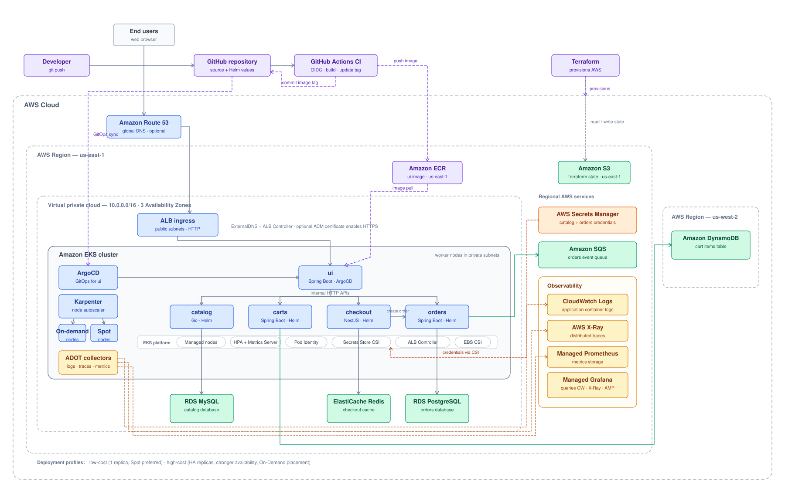

# Retail Store on Amazon EKS



An end-to-end deployment of a polyglot microservices retail application on Amazon EKS, provisioned entirely with Terraform and deployed with Helm and ArgoCD. Covers infrastructure-as-code, autoscaling, secrets management, observability, and GitOps-based CI/CD.

## Overview

This repository provisions a full production-style AWS environment and deploys a 5-service e-commerce application onto it:

- **Networking & compute:** a custom VPC and an Amazon EKS cluster, autoscaled with Karpenter (mixed on-demand + spot)
- **Data plane:** RDS (MySQL + PostgreSQL), DynamoDB, ElastiCache (Redis), and SQS — one managed AWS service per microservice's persistence need
- **Secrets:** database credentials pulled at runtime from AWS Secrets Manager via the Secrets Store CSI Driver — nothing sensitive is stored as a static Kubernetes Secret
- **Observability:** OpenTelemetry (ADOT) pipelines for traces, logs, and metrics, feeding AWS X-Ray, CloudWatch, and Amazon Managed Prometheus/Grafana
- **Delivery:** 4 of the 5 services are deployed via Helm; the 5th (`ui`) is deployed continuously via ArgoCD (GitOps), with a GitHub Actions pipeline building and publishing new images automatically

## Tech Stack

| Layer | Tools |
|---|---|
| Infrastructure as Code | Terraform |
| Container Orchestration | Amazon EKS (Kubernetes) |
| Autoscaling | Karpenter (on-demand + spot) |
| Package Management | Helm |
| GitOps / CD | ArgoCD |
| CI | GitHub Actions (OIDC → ECR, no long-lived keys) |
| Secrets | AWS Secrets Manager + Secrets Store CSI Driver |
| Observability | OpenTelemetry (ADOT), AWS X-Ray, CloudWatch, Amazon Managed Prometheus & Grafana |
| Data Stores | RDS (MySQL, PostgreSQL), DynamoDB, ElastiCache, SQS |
| Application | Java (Spring Boot), Go, Node.js/TypeScript microservices |

## Repository Structure

```
app/            Source code for all 5 microservices (each with its own Dockerfile)
.github/        GitHub Actions CI workflow
terraform/      VPC, EKS cluster + add-ons, Karpenter, OpenTelemetry, data plane
kubernetes/     Karpenter node config, OTel collector config, and reference-only
                raw K8s manifests (see note in that folder)
helm/           Chart source per service + environment values (low-cost / high-cost)
argocd/         ArgoCD Application manifest for GitOps deployment of `ui`
iam/            IAM policy documents for the various AWS integrations
scripts/        Operational helper scripts (topology checks, metric verification, etc.)
```

---

## Prerequisites

Install locally: `aws` CLI, `terraform` (>= 1.12), `kubectl`, `helm`, `git`.

Confirm your AWS CLI is configured:
```bash
aws sts get-caller-identity
```
Note your **Account ID** from the output — you'll need it below.

---

## Part 1 — One-Time Setup

These steps must be completed once, before any deployment command below. Several files contain deployment-specific example values for the AWS account, Terraform state bucket, GitHub repository, AWS resource endpoints, and optional domain configuration. Replace them with values from the AWS account and repository being used for the deployment.

### 1.1 Set your AWS Account ID

The AWS Account ID is used in IAM role ARNs, the ECR image URL, the Karpenter node role, and optional HTTPS ingress manifests. Find every file that currently contains the example Account ID:
```bash
grep -rl "180789647333" . --include="*.tf" --include="*.json" --include="*.yaml" --include="*.yml"
```
Replace it with the Account ID returned by `aws sts get-caller-identity`.

The main files used by the default deployment are:

- `.github/workflows/build-push-ui.yaml`
- `app/ui/chart/values-ui.yaml`
- `iam/github-actions-oidc-trust-policy.json`
- `kubernetes/karpenter/01_ec2nodeclass.yaml`

The search also returns reference-only raw Kubernetes manifests. Update those files only if you intend to deploy the raw manifests instead of Helm.

### 1.2 Create your own Terraform state bucket

```bash
aws s3api create-bucket --bucket YOUR-BUCKET-NAME --region us-east-1
aws s3api put-bucket-versioning --bucket YOUR-BUCKET-NAME --versioning-configuration Status=Enabled
```
Replace the example bucket name across all Terraform backend and remote-state blocks:
```bash
grep -rl "tfstate-dev-us-east-1-jpjtof" terraform/
```
Open each file this lists and replace it with `YOUR-BUCKET-NAME`.

### 1.3 Create the AWS Secrets Manager secret

Terraform *reads* this secret — it does not create it. It must exist before you apply `terraform/data-plane/`.
```bash
aws secretsmanager create-secret \
  --name retailstore-db-secret-1 \
  --secret-string '{"username":"retailadmin","password":"ChangeMe123!"}' \
  --region us-east-1
```
(Both `catalog` and `orders` reference this same secret name by default — that's expected.)

### 1.4 Create the ECR repository for `ui`

Only `ui` is built by this project's CI pipeline; the other 4 services pull pre-built public images, so no ECR setup is needed for them.
```bash
aws ecr create-repository --repository-name retail-store/ui --region us-east-1
```

### 1.5 Set up GitHub OIDC for CI

Create the OIDC identity provider (skip if your account already has one):
```bash
aws iam create-open-id-connect-provider \
  --url https://token.actions.githubusercontent.com \
  --client-id-list sts.amazonaws.com \
  --thumbprint-list 6938fd4d98bab03faadb97b34396831e3780aea
```

Open `iam/github-actions-oidc-trust-policy.json` and update the repo condition to point at your own GitHub username/repository.

Create the role and attach ECR push permissions:
```bash
aws iam create-role \
  --role-name github-actions-oidc-role-ui3 \
  --assume-role-policy-document file://iam/github-actions-oidc-trust-policy.json

aws iam attach-role-policy \
  --role-name github-actions-oidc-role-ui3 \
  --policy-arn arn:aws:iam::aws:policy/AmazonEC2ContainerRegistryPowerUser
```

### 1.6 Configure the UI CI and GitOps paths

The UI source code and its Helm chart are stored under `app/ui/`. Before using the pipeline, update `.github/workflows/build-push-ui.yaml` so it uses the following paths:

```yaml
on:
  push:
    paths:
      - "app/ui/src/**"
```

The Docker build context must be `app/ui`, and the step that updates the image tag must run from `app/ui`:

```yaml
docker build -t $IMAGE_URI app/ui

cd app/ui
```

In the same workflow, set `role-to-assume` to the ARN of the GitHub Actions role created in the previous step.

Then update `argocd/application-ui.yaml`:

```yaml
source:
  repoURL: https://github.com/YOUR-GITHUB-USERNAME/aws-eks-retail-store.git
  targetRevision: main
  path: app/ui/chart
```

If you renamed the repository or use a different default branch, update `repoURL` and `targetRevision` accordingly.

### 1.7 Replace AWS resource endpoints after Terraform creates them

The Helm values contain example endpoints because RDS, ElastiCache, and AMP addresses are unique to every deployment. Complete this subsection after Step 2.4 and before applying the OpenTelemetry manifests or installing the application Helm charts.

After applying `terraform/data-plane/` and `terraform/opentelemetry/`, get the generated values:

```bash
cd terraform/data-plane
terraform output catalog_rds_endpoint
terraform output checkout_redis_endpoint
terraform output orders_rds_postgresql_endpoint

cd ../opentelemetry
terraform output amp_endpoint
```

Use those outputs to replace the existing example values in:

| Generated value | Files to update |
|---|---|
| Catalog RDS endpoint | `helm/values/low-cost/values-catalog-v2.0.0.yaml` and the corresponding high-cost values file |
| Checkout Redis endpoint | `helm/values/low-cost/values-checkout.yaml` and the corresponding high-cost values file; append `:6379` to the output |
| Orders RDS endpoint | `helm/values/low-cost/values-orders-v2.0.0.yaml` and the corresponding high-cost values file |
| AMP remote-write endpoint | `kubernetes/opentelemetry/01_adot_collector_prometheus_full_k8s_cluster.yaml` |

Only the low-cost values are required for the deployment procedure in this README. Keep the high-cost values updated if you plan to use that profile later.

The Cart service intentionally uses a DynamoDB table in `us-west-2`; its provider, table, and Helm configuration already use that region.

### 1.8 Configure the optional domain and HTTPS values

If you want ExternalDNS and HTTPS, replace the example hostname and ACM certificate ARN with your own values. Use these searches to find every applicable file:

```bash
grep -rl "retailstore1.stacksimplify.com" app helm kubernetes
grep -rl "alb.ingress.kubernetes.io/certificate-arn" kubernetes
```

For the ArgoCD-managed UI deployment, the active hostname is configured in `app/ui/chart/values-ui.yaml`.

If you do not own a domain, remove the `external-dns.alpha.kubernetes.io/hostname` annotation and use the HTTP address created by the AWS Load Balancer Controller.

---

## Part 2 — Deployment

### 2.1 Provision the VPC
```bash
cd terraform/vpc
terraform init
terraform apply
```

### 2.2 Provision the EKS cluster and core add-ons
This creates the cluster plus the AWS Load Balancer Controller, EBS CSI Driver, Secrets Store CSI Driver, ExternalDNS, and Metrics Server.
```bash
cd ../eks-cluster
terraform init
terraform apply
```

### 2.3 Connect kubectl to the new cluster
```bash
aws eks update-kubeconfig --region us-east-1 --name eksdemo1
kubectl get nodes
```

### 2.4 Provision Karpenter, OpenTelemetry, and the data plane
These three are independent — apply them in any order.
```bash
cd ../karpenter && terraform init && terraform apply
cd ../opentelemetry && terraform init && terraform apply
cd ../data-plane && terraform init && terraform apply
cd ../..
```

### 2.5 Apply the Karpenter node configuration
```bash
kubectl apply -f kubernetes/karpenter/01_ec2nodeclass.yaml
kubectl apply -f kubernetes/karpenter/02_nodepool_ondemand.yaml
kubectl apply -f kubernetes/karpenter/03_nodepool_spot.yaml
```

### 2.6 Apply the OpenTelemetry pipeline configuration
```bash
kubectl apply -f kubernetes/opentelemetry/01_adot_collector_traces.yaml
kubectl apply -f kubernetes/opentelemetry/01_adot_collector_logs.yaml
kubectl apply -f kubernetes/opentelemetry/01_adot_collector_prometheus_full_k8s_cluster.yaml
kubectl apply -f kubernetes/opentelemetry/02_adot_instrumentation_traces.yaml
```

### 2.7 Deploy `catalog`, `cart`, `checkout`, `orders` via Helm

Add the chart repository once:
```bash
helm repo add stacksimplify https://stacksimplify.github.io/helm-charts
helm repo update
```

Then install each service, from inside `helm/values/low-cost/`:
```bash
cd helm/values/low-cost

helm upgrade --install catalog stacksimplify/retail-store-sample-catalog-chart \
  --version 2.0.0 -f values-catalog-v2.0.0.yaml --wait --timeout 5m

helm upgrade --install carts stacksimplify/retail-store-sample-cart-chart \
  --version 1.0.0 -f values-cart.yaml --wait --timeout 5m

helm upgrade --install checkout stacksimplify/retail-store-sample-checkout-chart \
  --version 1.0.0 -f values-checkout.yaml --wait --timeout 5m

helm upgrade --install orders stacksimplify/retail-store-sample-orders-chart \
  --version 2.0.0 -f values-orders-v2.0.0.yaml --wait --timeout 5m

cd ../../..
```

A convenience script that runs the same 4 commands automatically is available at `helm/values/low-cost/05-v2.0.0-install-remote-helm-charts.sh`.

### 2.8 Install ArgoCD
```bash
kubectl create namespace argocd
kubectl apply -n argocd -f https://raw.githubusercontent.com/argoproj/argo-cd/stable/manifests/install.yaml
kubectl rollout status deployment argocd-server -n argocd --timeout=120s
```

Get the admin password:
```bash
kubectl get secret argocd-initial-admin-secret -n argocd -o jsonpath="{.data.password}" | base64 --decode
```

Open the UI:
```bash
kubectl port-forward svc/argocd-server -n argocd 8080:443
```

### 2.9 Deploy `ui` via ArgoCD (GitOps)
```bash
kubectl apply -f argocd/application-ui.yaml
```
From here, ArgoCD manages `ui` continuously — it re-checks your repository every ~2 minutes and auto-syncs any changes, with no further manual deployment steps for this service.

### 2.10 Verify
```bash
kubectl get ingress
```
Open the address shown — that's your running application.

---

## Advanced / Optional

**HTTPS Ingress:** if you own a domain, provision an ACM certificate and replace the placeholder `certificate-arn` in `kubernetes/manifests/schedule-anyway/03_ingress/01_ingress_https_instance_mode.yaml` and `02_ingress_https_ip_mode.yaml`. Otherwise the HTTP ingress works without any domain.

**Spot interruption test:** a standalone workload demonstrating graceful handling of spot node interruptions:
```bash
kubectl apply -f kubernetes/karpenter/spot-interruption-test/Spot_Interruption_Handling.yaml
```

**High-cost values:** `helm/values/high-cost/` contains an alternate, larger-scale values set for each service, kept for reference — the deployment steps above use `low-cost/`.

**Raw Kubernetes manifests:** `kubernetes/manifests/` contains a full raw-YAML (non-Helm) version of the same application, in two topology-spread variants (`schedule-anyway` / `do-not-schedule`). These are kept for reference/comparison only — do not apply them alongside the Helm deployment above, as they would create conflicting resources.

---

## Tearing Down

```bash
helm uninstall catalog carts checkout orders
kubectl delete -f argocd/application-ui.yaml

cd terraform/data-plane    && terraform destroy && cd ../..
cd terraform/opentelemetry && terraform destroy && cd ../..
cd terraform/karpenter     && terraform destroy && cd ../..
cd terraform/eks-cluster   && terraform destroy && cd ../..
cd terraform/vpc           && terraform destroy && cd ../..
```
Also manually delete the Secrets Manager secret, the ECR repository, and the S3 state bucket for a fully clean AWS account.

---

## Acknowledgments

The application deployed by this project is the open-source [AWS Containers Retail Sample App](https://github.com/aws-containers/retail-store-sample-app).
